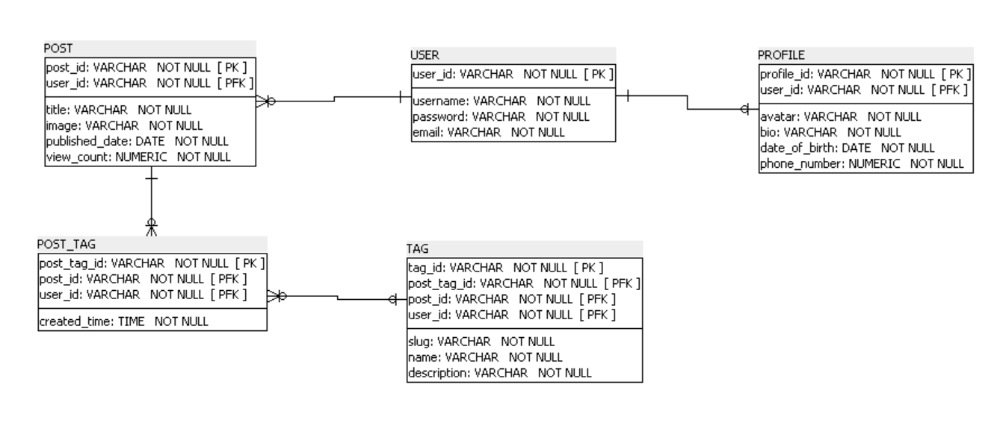

# 📘 Database Schema: Users, Profiles, Posts, Tags

This project defines a relational database schema based on RESTful routes for **Users, Profiles, Posts, Tags, and Post_Tags**.  




---

## 🔗 Complete Relationship Structure

**USERS ↔ PROFILES (One-to-One)**  
Each user has exactly one profile  

**USERS → POSTS (One-to-Many)**  
Each user can create multiple posts  

**POSTS → POST_TAGS (One-to-Many)**  
Each post can have multiple tag associations  

**TAGS → POST_TAGS (One-to-Many)**  
Each tag can be applied to multiple posts  

---

## 🗂 Schema (DDL)

```sql
CREATE TABLE USER (
    user_id VARCHAR NOT NULL,
    username VARCHAR NOT NULL,
    password VARCHAR NOT NULL,
    email VARCHAR NOT NULL,
    CONSTRAINT user_id PRIMARY KEY (user_id)
);

CREATE TABLE PROFILE (
    profile_id VARCHAR NOT NULL,
    user_id VARCHAR NOT NULL,
    avatar VARCHAR NOT NULL,
    bio VARCHAR NOT NULL,
    date_of_birth DATE NOT NULL,
    phone_number NUMERIC NOT NULL,
    CONSTRAINT profile_id PRIMARY KEY (profile_id, user_id)
);

CREATE TABLE POST (
    post_id VARCHAR NOT NULL,
    user_id VARCHAR NOT NULL,
    title VARCHAR NOT NULL,
    image VARCHAR NOT NULL,
    published_date DATE NOT NULL,
    view_count NUMERIC NOT NULL,
    CONSTRAINT post_id PRIMARY KEY (post_id, user_id)
);

CREATE TABLE POST_TAG (
    post_tag_id VARCHAR NOT NULL,
    post_id VARCHAR NOT NULL,
    user_id VARCHAR NOT NULL,
    created_time TIME NOT NULL,
    CONSTRAINT post_tag_id PRIMARY KEY (post_tag_id, post_id, user_id)
);

CREATE TABLE TAG (
    tag_id VARCHAR NOT NULL,
    post_tag_id VARCHAR NOT NULL,
    post_id VARCHAR NOT NULL,
    user_id VARCHAR NOT NULL,
    slug VARCHAR NOT NULL,
    name VARCHAR NOT NULL,
    description VARCHAR NOT NULL,
    CONSTRAINT tag_id PRIMARY KEY (tag_id, post_tag_id, post_id, user_id)
);

-- Foreign Key Constraints
ALTER TABLE PROFILE ADD CONSTRAINT USER_PROFILE_fk
FOREIGN KEY (user_id)
REFERENCES USER (user_id)
ON DELETE NO ACTION
ON UPDATE NO ACTION
NOT DEFERRABLE;

ALTER TABLE POST ADD CONSTRAINT USER_POST_fk
FOREIGN KEY (user_id)
REFERENCES USER (user_id)
ON DELETE NO ACTION
ON UPDATE NO ACTION
NOT DEFERRABLE;

ALTER TABLE POST_TAG ADD CONSTRAINT POST_POST_TAG_fk
FOREIGN KEY (post_id, user_id)
REFERENCES POST (post_id, user_id)
ON DELETE NO ACTION
ON UPDATE NO ACTION
NOT DEFERRABLE;

ALTER TABLE TAG ADD CONSTRAINT POST_TAG_TAG_fk
FOREIGN KEY (user_id, post_id, post_tag_id)
REFERENCES POST_TAG (user_id, post_id, post_tag_id)
ON DELETE NO ACTION
ON UPDATE NO ACTION
NOT DEFERRABLE; 
